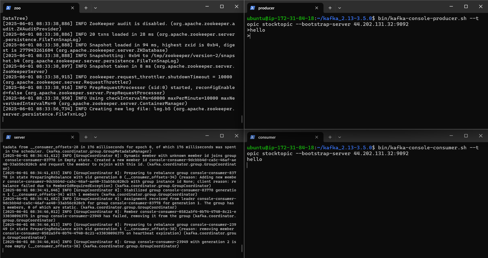
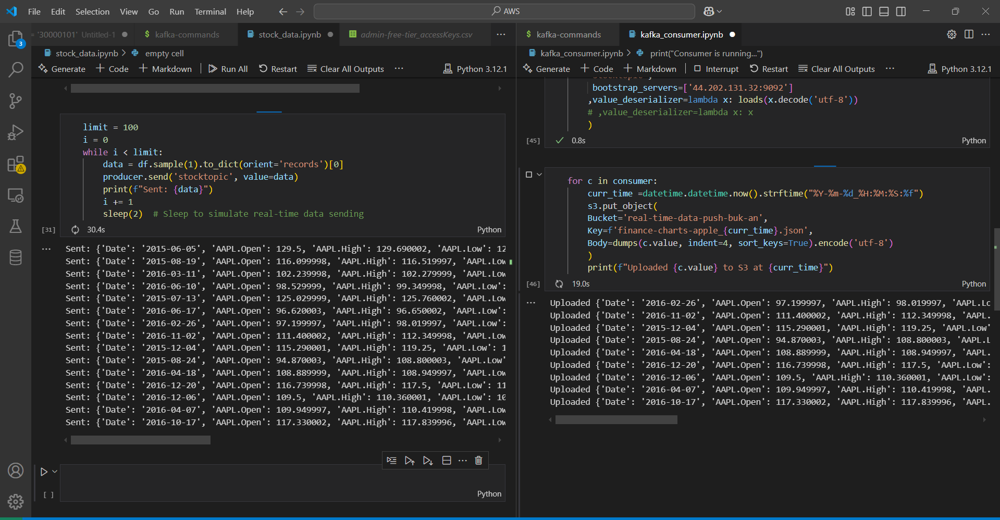
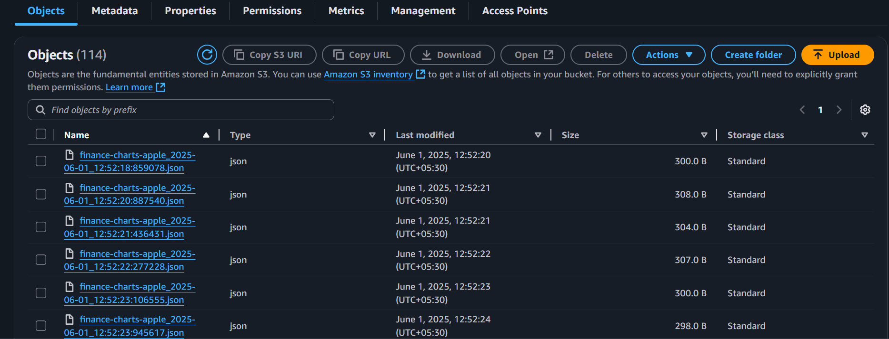

# Real time data ingestion to s3 data lake

An easy simple and solution to start with realtime data ingestion

pre-requites : AWS Free tier account, Kafka basics

## step 1 : setting up ec2

  lauch a ec2 instance and download kafka and java 
  
  wget https://archive.apache.org/dist/kafka/3.5.0/kafka_2.13-3.5.0.tgz
  
  tar -xzf kafka_2.13-3.5.0.tgz
  
  cd kafka_2.13-3.5.0

  sudo apt install -y openjdk-17-jdk
  
  java -version

## step 2 : setup kafka 

    kill existing running process

        pkill -f kafka.Kafka
    
        pkill -f zookeeper

    start Zookeper

        bin/zookeeper-server-start.sh config/zookeeper.properties   

    start kafka server

        export KAFKA_HEAP_OPTS="-Xmx512M -Xms256M"

        bin/kafka-server-start.sh config/server.properties

    create topic 

        bin/kafka-topics.sh --create --topic stocktopic --bootstrap-server 44.202.131.32:9092 --replication-factor 1 --partitions 1

    start producer 

        bin/kafka-console-producer.sh --topic stocktopic --bootstrap-server 44.202.131.32:9092 

    start consumer 

        bin/kafka-console-consumer.sh --topic stocktopic --bootstrap-server 44.202.131.32:9092

try sending messages 
    

## step 3: real time data generation using python and sending the data to kafka topic 
    
    Kafka_producer.ipynb

## step 4: connect to aws and ingest the data to s3 

    kafka_consumer.ipynb

data in s3

     

